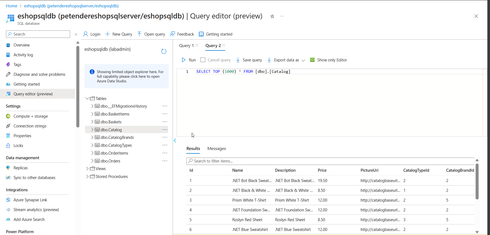

[comment]: <> (please keep all comment items at the top of the markdown file)
[comment]: <> (please do not change the ***, as well as 
 placeholders for Note and Tip layout)
[comment]: <> (please keep the ### 1. and 2. titles as is for consistency across all demoguides)
[comment]: <> (section 1 provides a bullet list of resources + clarifying screenshots of the key resources details)
[comment]: <> (section 2 provides summarized step-by-step instructions on what to demo)

[comment]: <> (this is the section for the Note: item; please do not make any changes here)
***
### EShopOnWeb Retail in IAAS - demo scenario

**Note:** Below demo steps should be used **as a guideline** for doing your own demos. Please consider contributing to add additional demo steps.

[comment]: <> (this is the section for the Tip: item; consider adding a Tip, or remove the section between 
 and 
 if there is no tip)

**Tip:** The same **EShopOnWeb Retail** application is also available in the **PAAS, ACI and AKS scenarios**. If you want to walk learners through the different Azure Architectures, running the same application workload, it's a quite powerful demo.

***
### 1. What Resources are getting deployed
This scenario deploys the sample **.NET EShopOnWeb Retail** application as a running **Windows WebVM and SQLVM** architecture. The WebVM is running Windows IIS 2019, the SQLVM is running Windows 2019 with SQL Server 2019. Both VMs belong to the same VNET (AzTrainingVNET), but each in a separate SubNet. The WebVM has a Public IP Address (Basic sku) attached, which allows direct internet connectivity.

There is no NSG defined, which allows you to demo how to optimize security. WebVM is sized as Standard_DS1_v2, the SQLVM is sized as Standard_DS4_v2, and has 3 disks attached. Virtual Disks are based on Azure Storage Account, allowing to demo a disk migration to Managed Disks. 

* MTTDemoDeployRGc%youralias%IAAS - Azure Resource Group
* WebVM and SQLVM - Windows Server 2019 Virtual Machines
* AzTrainingVNET - Azure Virtual Network (10.0.0.0/16) + FrontEndNetwork (10.0.0.0/24) and BackEndNetwork (10.0.1.0/24)
* WebPublicIP - Azure Public IP Address Resource, Basic sku, attached to the WebVM NIC

  

  

  

### 2. What can I demo from this scenario after deployment

The VM architecture is pretty "open", to allow you to go over different **VM optimizations**, for example:

- **Overall Azure VM Concepts**: walk learners through the different settings of an Azure VM (Overview, Monitoring,...)
- **Networking**: explain the concepts of VNETs and SubNets; change Public IP sku for better security; integrate NSG rules for additional security;
- **Storage**: migrate Storage Account disks to Managed disks
- **Sizing**: resize the VM to a different VM size
- **Applications**: by logging on to the WebVM using RDP, you can show that it is just like an on-premises VM, providing all features and local admin permissions (Note: the SQLVM is only available for RDP from within the WebVM)
- **Migration**: using Azure App Migration tool or Azure Database Migration Assistant (Note: these tools are not installed on the VMs at the moment), this scenario could be used to describe and show how applications can be migrated as-is ("Lift & Shift") from an IAAS architecture to PAAS Services

#### Networking Demo
1. Navigate to the **WebVM Overview**, and select the **Public IP Address**, to open its properties. 

  

1. Highlight the IP address is changing when the VM stops/starts, since it is configured as **Dynamic**. 
1. Highlight the **DNS name label**. Explain this is linked to the Azure DNS zones, but could be used as a C-Name alias in your custom DNS.
1. Open the Public IP Address Properties, and highlight the **Basic Sku**. Explain this allows ALL INCOMING traffic by default, and adding Network Security Group protection is highly recommended (see https://learn.microsoft.com/en-us/azure/virtual-network/ip-services/public-ip-addresses#sku for more details).
1. From the WebVM blade, **Networking**, it shows no NSG is configured.
1. From the Azure Portal, create a new resource of type **Network Security Group**. Deploy this in the same Resource Group as the WebVM, as well as in the same location.
1. Name the NSG "webvm_nsg"

  

1. Open the **webvm_nsg** resource. From the **Overview** section, explain the **default Inbound and Outbound Security Rules**
1. Navigate to **Settings/Inbound security rules**. Add a new inbound rule for **RDP-3389-Prio100 as DENY** as well as **HTTP-80-Prio110 as ALLOW**
1. Highlight the NSG informs the admin it is a security risk to allow Port 3389

  

1. From the **webvm_nsg" Settings**, navigate to **Network Interfaces**. Click **Associate** to link the NSG to the Internal NIC (WebVMNetworkInterface) of the WebVM. Explain you can do the same for the **FrontEndSubnet** if there were more Web Servers.
1. **Return** to the **WebVM**, and show the new **Networking** settings, having the Inbound port rules for the WebVM now.
1. Connect to the Public IP address from the browser again, showing the Inbound Rule **works for port 80**. 
1. When trying to RDP, connection will fail. **This confirms the Basic Public IP Sku behavior is now overruled by NSG security.**

<!-- #### Storage Demo

1. Both VMs are using **Azure Storage Account** Premium disks. These are created in a Storage Account **blob container**.
1. From either WebVM or SQLVM, navigate to **Disks**; 
1. **Click** the disk **Name** (e.g. **WebVMOSDisk**), to open its properties.
1. Highlight the **Storage Account Type** being a Premium SSD LRS, describe the **Performance settings** as well as the **Host caching** and **VHD URI.**
1. From a new Azure Portal tab, navigate to the **"vmstorage..."** Storage Account, and open **Storage Browser**.
1. Open **Blob Containers**. Open **VHDs** containers. Show the different VHD-files in here, holding the OS-disks for both VMs, as well as the additional data disks for the SQL VM.
1. From the **WebVM blade** / Disks / select **Migrate to managed disks**

  

**Note**: If you don't need to use the VM(s) right away anymore for other demos, feel free to execute the migration of the disks. Note this can take some time, so preferably during a break or after hours; once complete, you can show learners the difference in Disk properties. -->

#### Sizing Demo
1. From either WebVM or SQLVM, navigate to **Size** 
1. Show the **Current size**, as well as the list of all other available VM sizes in the deployed region
1. **Select a different Size**, and press **Resize** (**Note !!The Resize will be executed immediately, forcing a restart of the VM**)

#### App Migration from IIS to Azure App Service
1. Log on to the WebVM (credentials are in keyvault, and open the **Azure App Service Migration Tool** URL (https://azure.microsoft.com/en-au/products/app-service/migration-tools/).

  

1. Scroll down, and select **App Service Migration Assistant**, and select **Download Now**
1. Wait for the download and **run the setup**. This puts a shortcut on the desktop and Start Menu for the Migration Assistant
1. **Launch** the AppServiceMigrationAssistant tool
1. Within the tool, 
- Choose a Site: select **Default Web Site** + Click Next

  

- Assessment Report: this scan will report **13 success items, no warnings or errors**; go over some of the detected IIS and Web App components; click Next
    

  

- Login to Azure: authenticate to your Azure subscription using the **provided device code** (*the tool might detect Internet Explorer as default browser, so you will probably need to copy the deviceauth URL into Edge or Chrome*)

- Azure Migrate Hub: Select **Skip**, unless you want to expand on Azure Migrate

- Azure Options: provide the necessary Azure details for the **target App Service and Service Plan**
- **Note**: If you create a new App Service Plan, the tool assumes a Premium P1; this might fail in some Azure Subscriptions. In that case, select an existing App Service Plan if available, or create one in your Azure Subscription first.

  

    - Migration Results: **Confirm by clicking Migrate**

1. Browse to the App Service in your Azure Portal, and discuss some of its settings.

  

1. Navigate to the website URL; notice the migrated application is working as expected.
**Note**: *The fact the web app is working without having migrated the SQL DB is because it is developed as such; if there is no SQL DB available, it will fallback on a local db file*. 

  

1. This **completes** the demo of App Migration to Azure App Service

#### SQL Server DB Migration to Azure SQL DB

**Prereqs**: 
- This demo requires the **install of DotNet Framework 4.8** as dependency of Database Migration Assistant, including a reboot after the install of the Framework. Consider doing this before running the live demo. 
- This demo requires an **Azure SQL Server and Database Instance** to be deployed already; you will migrate the SQLVM DB into the Azure SQL Server instance as new database  

1. Log on to the WebVM, and open Edge or Chrome browser
1. Navigate to the **Dotnet Framework 4.8** download website: https://dotnet.microsoft.com/en-us/download/dotnet-framework/net48
1. Download and run the setup. Once complete, restart the WebVM
1. After the WebVM reboot, navigate to the **Database Migration Assistant** download website - https://www.microsoft.com/en-us/download/details.aspx?id=53595
1. Open **Database Migration Assistant**; select New **Migration**
1. Source Server: **SQLVM**
1. Target Server Type: **Azure SQL Database**
1. Migration Scope: **Schema and Data**

  

1. Confirm the Migration Project; click **Create** to continue
1. Connect to Source Server: Server Name: **sqlvm** / Authentication Type: **Windows Authentication**
1. Select **Encrypt Connection** and **Trust Server Certificate**
1. Click **Connect**; select the **Microsoft.EShoponWeb.CatalogDb**

  

1. Click **Next**
1. Provide the necessary details for the **target Azure SQL Server Instance**
1. Select **Encrypt Connection** and **Trust Server Certificate**
1. Click **Connect**

  

1. Select **all tables**

  

1. Select **Generate Script**

  

1. Select **Run Migration**

  

1. Wait for the migration to complete; 

  

1. Once the migration is complete, switch to the **Azure Portal**, and navigate to the **Azure SQL Instance** used for the migration. Authenticate to the Azure SQL Database, and open **Query Editor**. Show the database table structure and the actual content of a table.

  

This completes the SQL Azure Migration demo.

[comment]: <> (this is the closing section of the demo steps. Please do not change anything here to keep the layout consistant with the other demoguides.)
  
***

**Note:** This is the end of the current demo guide instructions.

